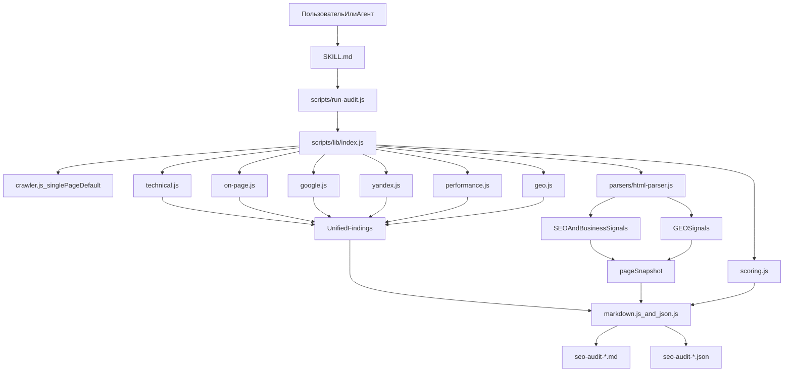

# IndexLift SEO Auditor - инструкция на русском

Этот репозиторий содержит только один продукт: `SEO + GEO` skill для агентов и Cursor, который по умолчанию делает сверхподробный аудит одной страницы и формирует отчеты отдельно под Google, Yandex и AI-видимость.

## Что находится в репозитории

- `.agents/skills/indexlift-seo-auditor/` - сама skill-папка
- `.agents/skills/indexlift-seo-auditor/SKILL.md` - описание skill для агента
- `.agents/skills/indexlift-seo-auditor/scripts/run-audit.js` - точка запуска аудита
- `.agents/skills/indexlift-seo-auditor/scripts/lib/` - встроенный runtime: crawler, parser, checks, scoring, reporters
- `.agents/skills/indexlift-seo-auditor/references/` - справка по установке и списку проверок

## Схема работы репозитория



## Как это работает по шагам

1. Агент или пользователь запускает `scripts/run-audit.js`.
2. Скрипт принимает URL страницы, режим аудита, tier и список движков.
3. В default-режиме `single-page` встроенный crawler fetch-ит только стартовую страницу, а `robots.txt` и sitemap использует как контекст сайта.
4. HTML parser разбирает страницу и извлекает SEO, business и GEO-сигналы.
5. Набор проверок строит findings:
   - технические проблемы
   - on-page проблемы
   - сигналы для Google
   - сигналы для Yandex
   - легкие performance-сигналы
   - GEO-сигналы для AI answer visibility
   - context-only сигналы, которые не должны искажать итоговый score
6. Scoring engine считает баллы по категориям и общий score только по честным page-level SEO-данным.
7. Reporters создают два результата:
   - Markdown-отчет для чтения человеком
   - JSON-артефакт для последующей обработки агентом
   - внутри отчетов есть отдельные GEO-блоки: что уже помогает AI, чего не хватает и что исправить первым

## Структура логики внутри skill

```text
run-audit.js
  -> lib/index.js
     -> crawler.js
     -> parsers/html-parser.js
     -> checks/*.js
     -> scoring.js
     -> reporters/*.js
```

## Как установить в Cursor

Есть два варианта.

### Вариант 1. Открыть весь репозиторий

1. Клонируй репозиторий.
2. Открой его в Cursor.
3. Cursor увидит skill в `.agents/skills/indexlift-seo-auditor/`.

### Вариант 2. Скопировать только skill

Можно скопировать только папку:

```text
.agents/skills/indexlift-seo-auditor/
```

в:

```text
~/.cursor/skills/indexlift-seo-auditor/
```

Так как runtime уже встроен внутрь skill, отдельный `src/` не нужен.

## Как запустить аудит вручную

Перейди в папку skill:

```bash
cd .agents/skills/indexlift-seo-auditor
```

Установи зависимости:

```bash
npm install
```

Запусти аудит:

```bash
node scripts/run-audit.js --url "https://example.com" --tier standard --engines google,yandex --output ./deliverables/
```

Если нужен старый режим с обходом внутренних страниц, можно запустить:

```bash
node scripts/run-audit.js --url "https://example.com" --mode crawl --tier standard --engines google,yandex --output ./deliverables/
```

## Аргументы запуска

- `--url` - адрес сайта для аудита
- `--mode` - режим аудита: `single-page` по умолчанию или `crawl`
- `--tier` - уровень отчета и вспомогательных модулей: `basic`, `standard`, `pro`
- `--engines` - список движков, например `google,yandex`
- `--output` - папка, куда будут сохранены результаты
- `--max-pages` - лимит страниц для обхода, если включен `--mode crawl`
- `--max-depth` - глубина обхода, если включен `--mode crawl`

## Что создается на выходе

После запуска skill сохраняет:

- `seo-audit-<site>-<date>.md` - человекочитаемый SEO-отчет
- `seo-audit-<site>-<date>.json` - структурированный JSON с findings, score и деталями crawl

## Что именно проверяет skill

- Техническое SEO страницы: HTTPS, response status, redirects, canonicals, indexability, mixed content, размер HTML
- On-page SEO страницы: title, description, H1, headings, alt, lazy loading, internal links
- Google SEO: canonical alignment, JSON-LD, viewport, structured/preview coverage, contextual hreflang note
- Yandex SEO: canonical consistency, micro-markup, document size, contextual robots/sitemap note
- Performance: скорость ответа HTML, размер HTML, asset count, script pressure, image pressure
- GEO: answer-first intro, question-led structure, FAQ/HowTo and entity schema, author/date/reference signals, chunkable sections и GEO priorities

## Только бесплатные инструменты

Этот skill специально работает только на бесплатных локальных инструментах, которые уже лежат в репозитории.

Он не использует:

- платные SEO API
- платные backlink-сервисы
- платные SERP-провайдеры
- платные сервисы конкурентной аналитики

## Когда использовать этот репозиторий

Используй его, если нужно:

- провести максимально подробный SEO-аудит одной страницы
- проверить технические SEO-ошибки
- получить отдельные findings под Google и Yandex
- отдать агенту готовый JSON и Markdown результат

## Важно

- Это не агентская платформа.
- Это не dashboard.
- Это не SERP scraper.
- Это только self-contained skill со встроенными скриптами аудита.
